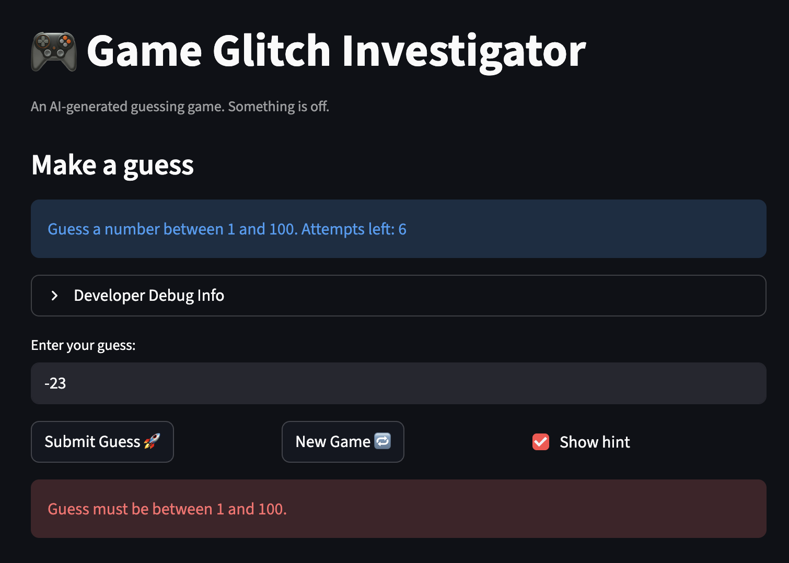

# 🎮 Game Glitch Investigator: The Impossible Guesser

## 🚨 The Situation

You asked an AI to build a simple "Number Guessing Game" using Streamlit.
It wrote the code, ran away, and now the game is unplayable. 

- You can't win.
- The hints lie to you.
- The secret number seems to have commitment issues.

## 🛠️ Setup

1. Install dependencies: `pip install -r requirements.txt`
2. Run the broken app: `python -m streamlit run app.py`

## 🕵️‍♂️ Your Mission

1. **Play the game.** Open the "Developer Debug Info" tab in the app to see the secret number. Try to win.
2. **Find the State Bug.** Why does the secret number change every time you click "Submit"? Ask ChatGPT: *"How do I keep a variable from resetting in Streamlit when I click a button?"*
3. **Fix the Logic.** The hints ("Higher/Lower") are wrong. Fix them.
4. **Refactor & Test.** - Move the logic into `logic_utils.py`.
   - Run `pytest` in your terminal.
   - Keep fixing until all tests pass!

## 📝 Document Your Experience
This game's purpose is to entertain the user. With three difficulty levels, the game gives the user a specific number of attempts to guess a secret number, and the user can choose to display hints or not.

I found three main bugs. The first bug was that the "Go higher" and "Go lower" hint messages were swapped. The second but was that the "New Game" button did not work, meaning that there was no way for the user to reset the game. The final bug was that the user could enter guesses out of the allowed range (there was no input validation).

I fixed the game by swapping when the "Go higher" and "Go lower" hint messages were displayed and resetting the game state (guess history, attempts, secret number, etc) when the "New Game" button is clicked. I also added an error message when the user inputs an out-of-bound guess. Additionally, I refactored some logic code from app.py to logic_utils.py. I used Copilot as an assistent.

## 📸 Demo

- [ ] 

## 🚀 Stretch Features

- [ ] [If you choose to complete Challenge 4, insert a screenshot of your Enhanced Game UI here]
